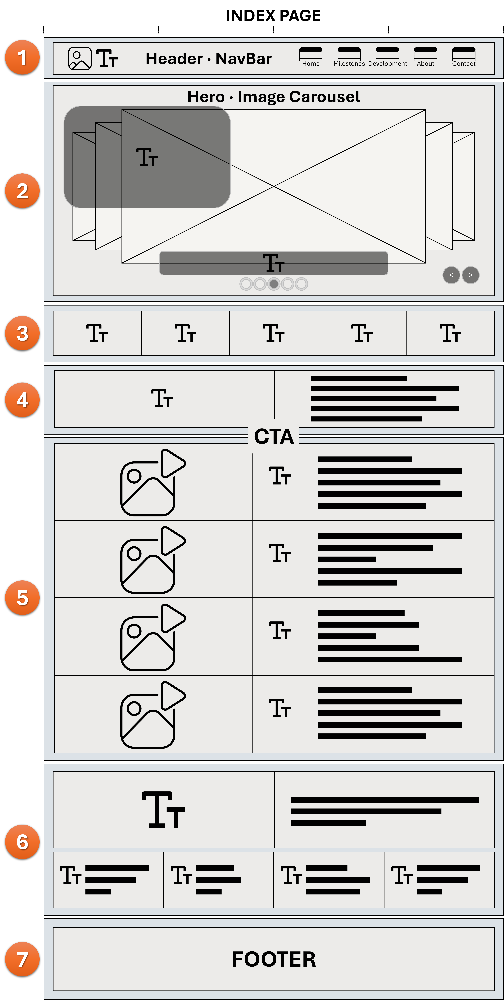
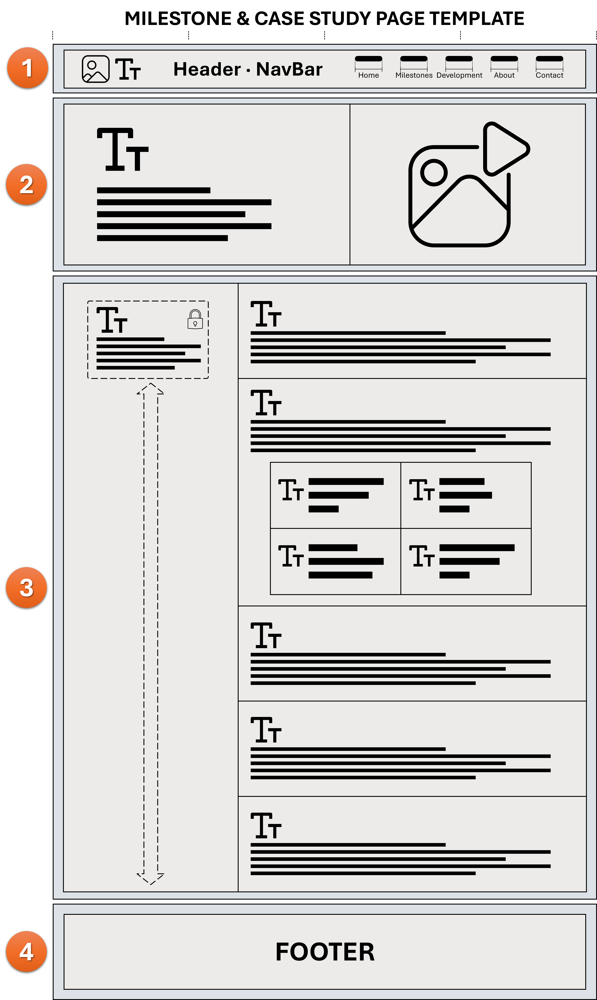
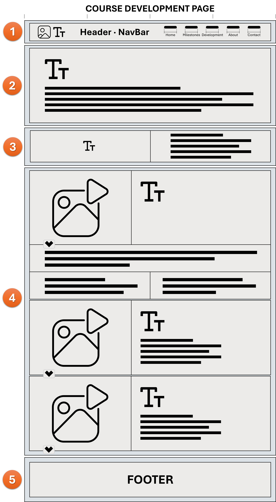
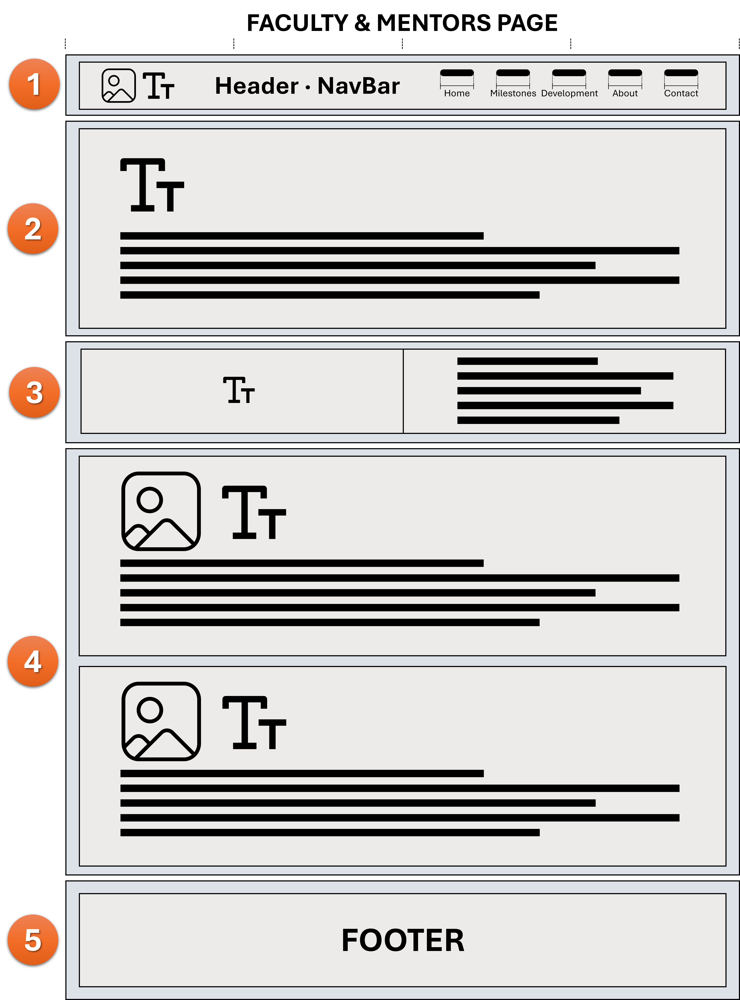
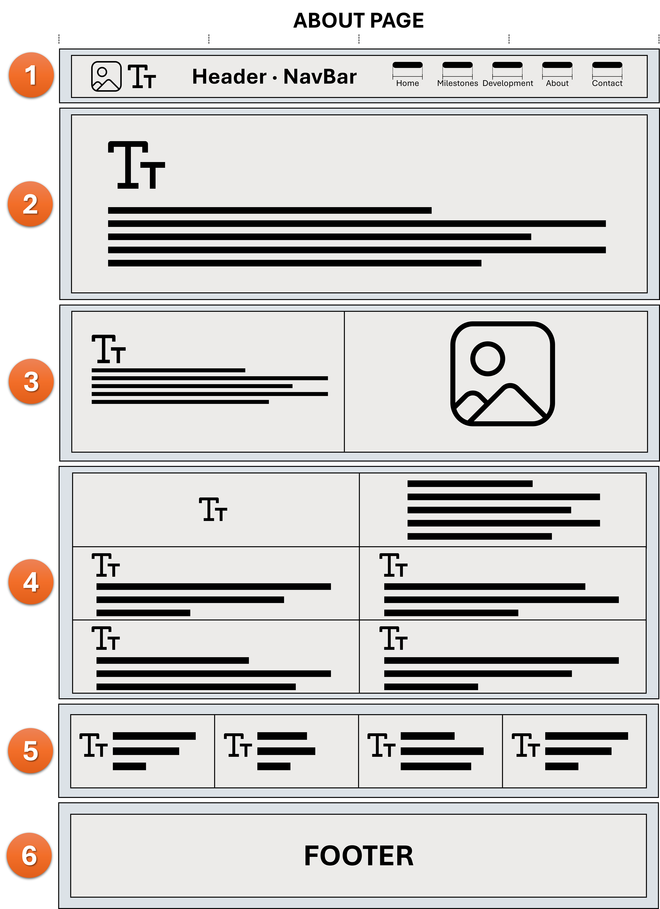
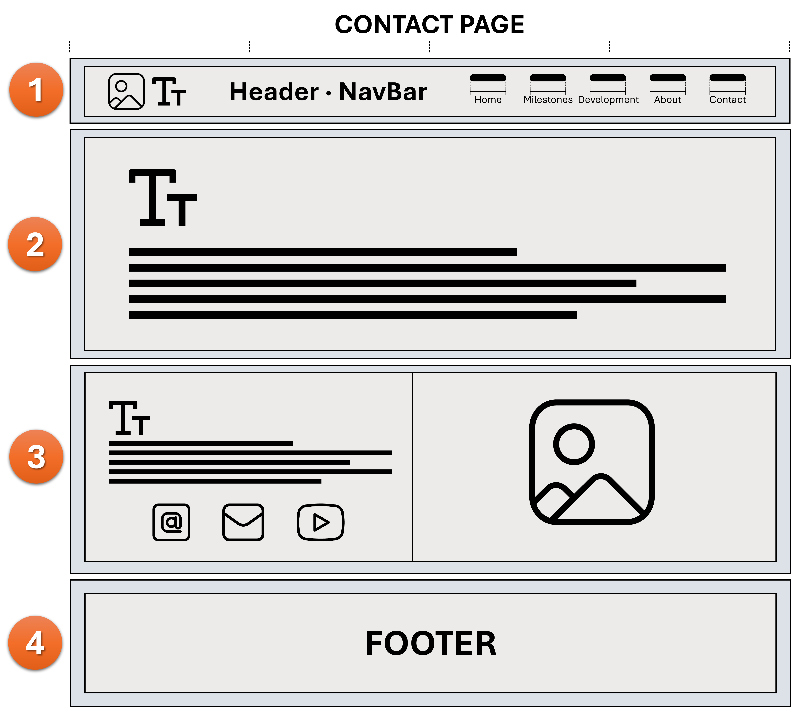
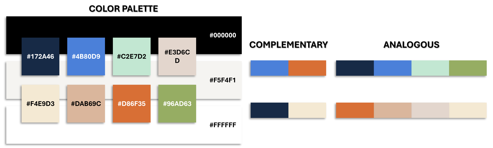

# Alex Cabrera Game Development Portfolio
Personal game development portfolio showcasing programming, artificial intelligence, interactive systems, 3D design, web development, and selected academic projects that document my growth, skills, and development process.

## Portfolio Overview
This repository contains the source files for my personal ePortfolio and game development website. The site presents selected projects, technical work, design development, and the progression of skills I have built through game programming, artificial intelligence, web development, graphic design, and 3D modeling.

The portfolio is designed as a professional record of both completed work and the development process behind it. Each featured project focuses on the problem, technical approach, tools used, decisions made, and lessons carried forward into later work.

## Website Template Direction
The following layouts represent the template structure I plan to use for the site. These wireframes define the page system, content hierarchy, and modular sections that will support the portfolio as it grows. The intent is to keep navigation consistent, present milestone work clearly, and maintain a structure that can expand without forcing a redesign each time a new project is added.

## Featured Development Themes
The primary portfolio work is organized around four development themes:
- **Vision** — Establishing the direction, structure, and continuity of my game development work.
- **Resilience** — Building and refining gameplay systems while working through technical and design constraints.
- **Transformation** — Reworking earlier concepts across tools, platforms, and development approaches.
- **Intelligence** — Applying artificial intelligence, procedural systems, analytics, and adaptive game mechanics.

## Site Structure
The portfolio includes the following primary areas:
- **Home** — Portfolio introduction and featured work
- **Work** — Selected projects organized around Vision, Resilience, Transformation, and Intelligence
- **Development** — Course development history, supporting projects, and faculty or mentor influences
- **About** — Background, skills, experience, and transition into game development
- **Contact** — Professional contact information and project links

## Template Pages
### Index Page

The Index Page serves as the main landing page for the portfolio. It introduces the overall identity of the site, highlights the core development areas, and brings the four milestone projects forward immediately. The goal is to make the first page visually strong, easy to navigate, and clear about the purpose of the portfolio.
1. **Header / NavBar:** Site primary navigation. Keeps Home, Milestones, Development, About, and Contact available from every page.
2. **Hero / Image Carousel:** Rotating hero artwork presents my main development areas. Includes the portfolio identity overlay, large centered topic title, pagination dots, and manual carousel controls.
3. **Core Skills:** Quick overview of the five areas that support my work: systems design, programming, visual design, testing, and documentation.
4. **Selected Work Introduction:** Introduces the four projects I selected as major development milestones and explains why they are presented up front.
5. **Four Milestone Projects:** Animated GIF or video previews on the left with project context on the right. Hover effects add movement and each card links to its full case study.
6. **Professional Identity / Development Direction:** Connects my technical background, development approach, and the principles that define my portfolio. Can use infographic elements, icons, and short text blocks.
7. **Footer:** Standard site footer with secondary navigation and supporting links.

---

### Milestone / Case Study Page Template

This page template is designed for the main case studies in the portfolio. It gives each milestone project enough structure to present the work clearly while keeping the layout consistent from one project to the next. The goal is to show the project, the process, and the technical development behind it without overwhelming the viewer.
1. **Header / NavBar:** Site primary navigation. Keeps Home, Milestones, Development, About, and Contact available from every page.
2. **Project Introduction / Media:** Project title, course, purpose, role, technologies, and a large GIF, video, or project image. The media gives the viewer immediate visual context.
3. **Case Study Content:** Detailed breakdown of the project, including purpose, development process, systems, challenges, results, and reflection. The left project summary can remain visible while scrolling.
4. **Footer:** Standard site footer with secondary navigation and supporting links.
5. **Template:** The same structure can be reused for new project case studies as the portfolio grows.

---

### Course Developments Page

The Course Developments page is intended to show the full progression of projects across the program rather than only the final highlighted work. It acts as a development history page that ties together classes, technical growth, and the projects that supported my movement toward the larger portfolio milestones.
1. **Header / NavBar:** Site primary navigation. Keeps Home, Milestones, Development, About, and Contact available from every page.
2. **Page Introduction:** Explains that this page presents the complete course development history and how the projects have contributed to my progression / development.
3. **Development Context:** Short overview of the project history, course progression, or defining terms used to organize the work.
4. **Project Cards:** Each project uses an animated GIF or video preview with project title, course, term, summary, technologies, and expandable project details. Each project also links to its own Case Study page.
5. **Footer:** Standard site footer with secondary navigation and supporting links.
6. **Modularity:** This section is designed to expand as new projects are completed without changing the overall page structure.

---

### Faculty & Mentors Page

This page is designed to recognize the professors and mentors who had a meaningful impact on my development. Rather than burying those contributions inside another page, this layout gives them their own dedicated space and connects their influence directly to the projects and technical growth shown throughout the portfolio.
1. **Header / NavBar:** Site primary navigation. Keeps Home, Milestones, Development, About, and Contact available from every page.
2. **Page Introduction:** Explains why I am recognizing the professors and mentors who had a meaningful impact on my development.
3. **Development Connection:** Short statement connecting instruction and mentorship to the projects, technical skills, and decisions shown throughout the portfolio.
4. **Faculty / Mentor Cards:** Photo on the left with name, course or role, contribution, and Associated Course Project(s). Images use rounded corners with a subtle hover lift and shadow. *(Have to reach out to each for their permission.)*
5. **Footer:** Standard site footer with secondary navigation and supporting links.
6. **Modularity:** The card system can be expanded as additional professors, mentors, or professional influences are added.

---

### About / Skills Page

The About / Skills page combines personal background with professional direction. It provides the narrative behind the portfolio while also organizing the technical and creative capabilities that support the work. The intent is to connect previous experience, current development work, and the skills that define the portfolio.
1. **Header / NavBar:** Site primary navigation. Keeps Home, Milestones, Development, About, and Contact available from every page.
2. **About Introduction:** Introduces my background, transition into game development, and the professional identity behind the portfolio.
3. **Background + Visual Profile:** Combines a short career narrative with a professional image, infographic, or other visual that connects my previous experience to my current development work.
4. **Skills and Capabilities:** Organizes skills into clear categories such as programming, game development, visual design, AI, testing, and documentation.
5. **Tools / Supporting Skills:** Quick-reference area for programming languages, engines, applications, development tools, and other supporting technical capabilities.
6. **Footer:** Standard site footer with secondary navigation and supporting links.

---

### Contact Page

The Contact page is designed to be direct and simple. It gives visitors a clear path to connect with me professionally while still staying visually tied to the rest of the site. The supporting graphic area can reinforce the portfolio identity without competing with the contact details themselves.
1. **Header / NavBar:** Standard site navigation and identity.
2. **Contact Introduction:** Short statement explaining what I am looking for and how visitors can connect with me.
3. **Contact + Professional Profile:** Direct links for email, LinkedIn, YouTube, and other professional platforms. The right side can use my portfolio infographic, profile image, or other related visuals.
4. **Footer:** Standard site footer with secondary navigation and supporting links.

---

## Visual Direction and Color Palette

The site visual system will use a palette built around black, white, cool blues, mint, and grounded warm tones. The cool colors support the technical and modern side of the portfolio, while the warm tones add balance and help keep the presentation from feeling sterile. This palette provides both contrast and flexibility across navigation, hero sections, cards, icons, and supporting content blocks.

**Primary palette values:**
- `#000000`
- `#FFFFFF`
- `#F5F4F1`
- `#172A46`
- `#4B80D9`
- `#C2E7D2`
- `#E3D6CD`
- `#F4E9D3`
- `#DAB69C`
- `#D86F35`
- `#96AD63`

## Areas of Focus
- Game Programming
- Gameplay Systems
- Artificial Intelligence
- Python Development
- C++ Development
- Unreal Engine
- Interactive Web Development
- 3D Modeling
- Graphic Design
- Technical Documentation
- Git and GitHub

## Technologies
The site is being developed with:
- HTML5
- CSS3
- JavaScript
- Bootstrap 5
- Bootstrap Icons
- Git
- GitHub
- GitHub Pages

Additional project technologies represented throughout the portfolio include Python, C++, Unreal Engine, Adobe creative tools, 3D modeling software, and AI-focused development workflows.

## Repository Purpose
This repository serves as the development source for the live portfolio website. It is intended to remain active beyond the original academic projects and continue growing as new game development, AI, software, and interactive projects are completed.

## Deployment
The website is designed for deployment through **GitHub Pages**.

Repository:
`alex-cabrera-gamedev-portfolio`

## Author
**Alex Cabrera**  
Game Development | Artificial Intelligence | Interactive Systems

GitHub identity: **GrumpyOldMarine**

---

This portfolio is an evolving record of development work, technical growth, and applied problem solving across game development and related interactive technologies.
